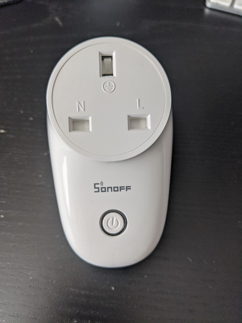

# Blåser

I wanted to create an automation function that monitored Los Diablos's room temperature and turned on the fan when it hit a certain level. We've done such an amazing job insulating their room that it gets hot, very hot and as such, they turn on the fan often but forget to turn it off. 

## Hardware Needed

First up was breaking down what bits I needed and they were:

1. [VINDRIKTNING](https://github.com/danielcuthbert/home-assistant/tree/main/VINDRIKTNING) modded with a Wemos D1 and a [DHT22](https://www.adafruit.com/product/385) low-cost digital temperature and humidity sensor. These three will provide both the PM 2.5 readings, temperature and humidity. 
2. A fan 
3. A way to control said fan. The one we have isn't fancy at all, it uses push buttons (I, II, III) to change the speed and you can power it from the wall socket. 

The plug got me thinking about best hardware choices. I love the Espressif [SoC's](https://www.espressif.com/en/products/socs) and want to use this with ESPHome, so the obvious choice was one built around ESP8266. Using [this](https://www.esphome-devices.com/standards/uk) page on the ESPHome website, I narrowed down ones that had a UK plug and went from there.

Eventually I decided on the [Sonoff S26 plug](https://sonoff.tech/product/smart-plug/s26/)

### Tear Down & Explore

One way I find easier to learn things myself is to not google like mad and read what others have done, but do it myself and when stuck, then go seek help. First step is to take it apart and see what they did. 

Fundamentally this device is plugged into a wall socket, which here in the UK offers 230 Volts alternating current (AC). You then plug in the device you want to control and can do that via Wi-Fi. Once that's understood, I find it easier to reverse engineer the thing I'm looking at (YMMV, this works for me but might not for you, don't take this as gospel).

First thing I noticed was a gap in the PCB and I've never seen this before (mostly as I've yet to play around with high voltage stuff). I spent a good hour googling this and reading up about this as much as possible. 

Ok cool, so this helps with safety and powa, got it. The rest of the circuit looks well-designed with isolation between the bits. I then snap a picture, note all the components down and google for their datasheets to understand them, their function and relationship to others. 

The flow is as follows:

AC 230V --> Bridge Rectifier --> Step Down Converter --> Low drop out linear converter --> ESP8266

The [Bridge Rectifier](https://www.farnell.com/datasheets/2861126.pdf) takes AC to DC and converts it to output. You need this when working with electronic components or devices such as the ESP8266. Then it needs to be stepped down to 5V and it does this using the step down [converter](https://pdf1.alldatasheet.com/datasheet-pdf/view/310141/WEITRON/WT1117AD-15.html). This is where the creepage gap came into play, you don't want power arcing across the board. 

Next up is stepping down the 5V to 3.3V for the ESP8266 and the low drop out linear converter does this. That powers the ESP8266 and all is good to go. 

Flipping the board over and you will see the custom PCB that houses the ESP8266. 

I love it when people add proper documentation to stuff, it makes it easier to see 4 pins we know and love:

ETX
ERX
VCC
GND

This means we can use a serial to USB adapter and write to it once we've added some wires. 

## Flashing ESPHome Preparation

I could have soldered some wires onto the other side of the main PCB but seeing as they were so nicely labelled on the ESP8266, I didn't see the point of the hassle. 

At this point you need a serial to USB adapter (F232) of which there are many. The one I now use is called [Tigard](https://github.com/tigard-tools/tigard) and it's by [Mr Joe FitzPatrick](https://securinghardware.com/), who I'm lucky to call a friend and a great teacher. 

The following steps will use this, but it shouldn't be hard to adapt for what ever board you choose. 

**Pins**

Once you've soldered on the wires, they need to be connected to the board this way. 

| Sonoff S26 | Tigard |
| ---------- | ------ |
|    ETX        |  RX      |
|    ERX        |  TX      |
|    VCC        |  TVGT      |
|    GND        |  GND      |

## ESPHome Code

Before you flash it, you need a binary in order to flash it. The ESPHome page [lists](https://www.esphome-devices.com/devices/Sonoff-S26/) a sample one but I've also included the one I use as a template. 

A few things to note here. This is a device that *needs* security, so make use of the new API encryption feature for ESPHome that utilises the [Noise Protocol Framework](https://noiseprotocol.org/), an epic protocol that allows you to create really simple crypto protocols. Enabling it couldn't be [easier](https://esphome.io/components/api.html). 

You really should do this with such a device. Security first. 

Once you've done all the above and created the firmware, it is time to get it into programming mode. Normally this is done via bridging GPI00 to GND when powering it on but that's a faff and luckily the power button does this for you. 

With the Tigard wired up to the board, you need to first make sure that you've selected the 3.3V on the Tigard, which is doable using the switch on the side. Make sure you do this BEFORE you power and connect it all up. 

**Oh and please do not do this with the actual plug powered by mains. **

Hold down the power button and put in the USB cable and release the power button. This is the fiddly bit but it is doable. If you see a green LED, you didn't do it right. If you see no LED, you should see Tigard appear as so:

`/dev/cu.usbserial-TG1000000`

Using the firmware you've just created, issue the following command to flash the device

`esptool.py --before default_reset --after hard_reset --baud 460800 --chip esp8266 --port /dev/cu.usbserial-TG1000000 write_flash 0x0 ~/hardware/firmware.bin`

This is what should happen

Whoop, we've flashed it and it should appear online shortly when you power-cycle the Tigard. Now desolder the wires and put the unit back as it was. 

## Automate