# Förnuftig Air Purifier

Since I had both external and internall pollution sensors, I saw levels rise when we opened the windows and this annoyed me. I wanted the ability to clean the internal air so that the kids were not breathing in crap from pollution. However, finding a purifier that didn't cost the earth and maybe could be fiddled with, was hard, well at least until I found out about IKEAs [Förnuftig](https://www.ikea.com/gb/en/p/foernuftig-air-purifier-black-40488065/).

A cheap air purifier that allows you to use both a particle filter and gas filter, optimized to filter away approximately 99.5 percent of smaller airborne particles such as PM2.5 particles, dust and pollen.

Sweet, meatballs and shopping time!

## What's Inside?

Opening it up and you see a basic PCB and rotary switch that controls the fan and speed of the fan:

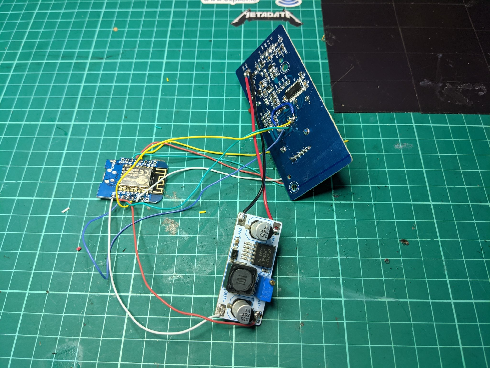
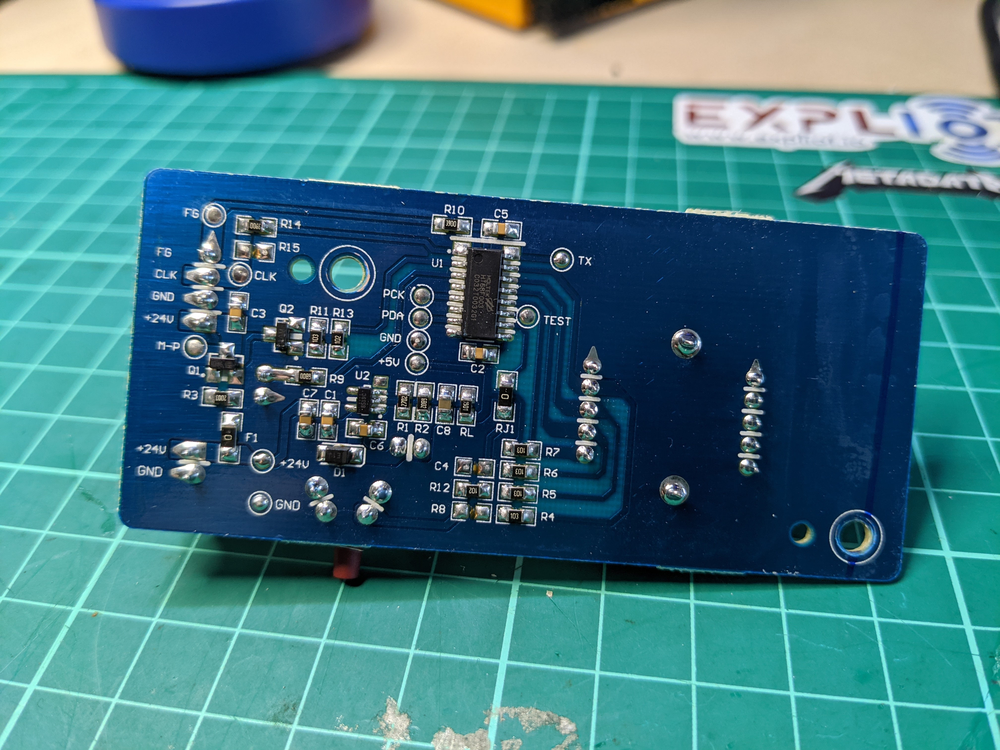

Turning it on and it does indeed receive 24V, which could be a problem for the planned Wemos D1.

## Bill of Materials

You will need the following:

1. ESP32 or ESP8266. I chose a Wemos D1 for the size as it slotted in the casing nicely.
2. A DC-DC Adjustable Voltage Step Down Module. I chose the LM2596S.
3. Wires

## Connecting It All

The idea was that I wanted to control the fan using Home Assistant and not the rotary dial but also use the dial at the same time and this threw me a bit. 

### Step Down Module

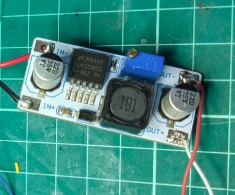

Basically 24V in and add wires to out. The out goes to the 5V and GND on the Wemos.

### Förnuftig PCB

This is where it gets a bit complicated. 

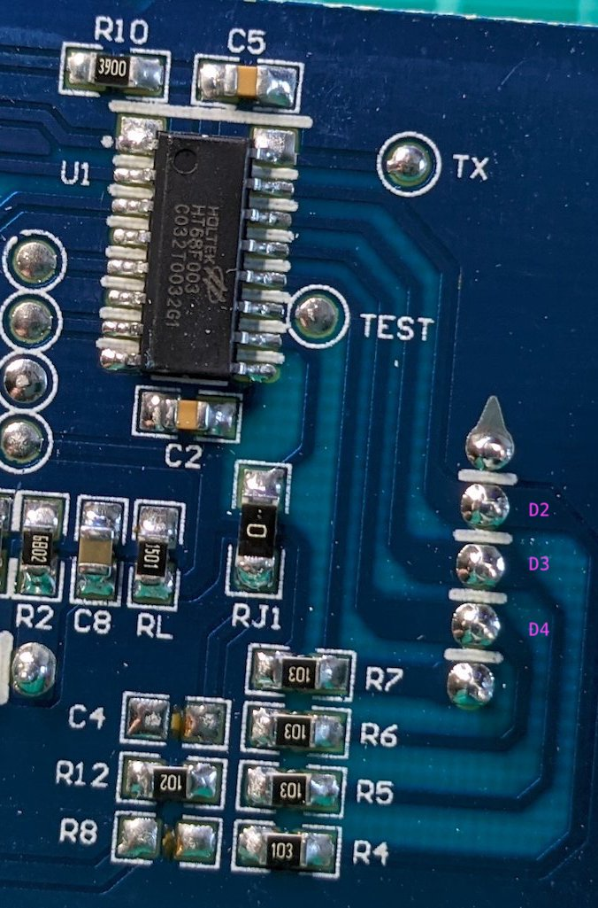

Solder some wires onto the following pins at the back. You also need to add a wire to the following pin for A0 

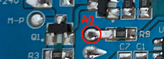

Then on the rotary controller PCB, solder more wires onto these pins

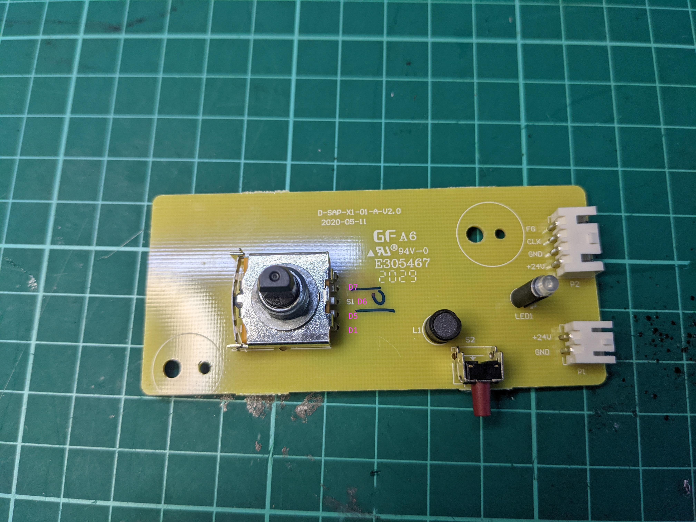

Once you've done this, and connected the wires to the Wemos, it should look like this:

If so, time to break out the hot glue gun and carefully put it all back. 

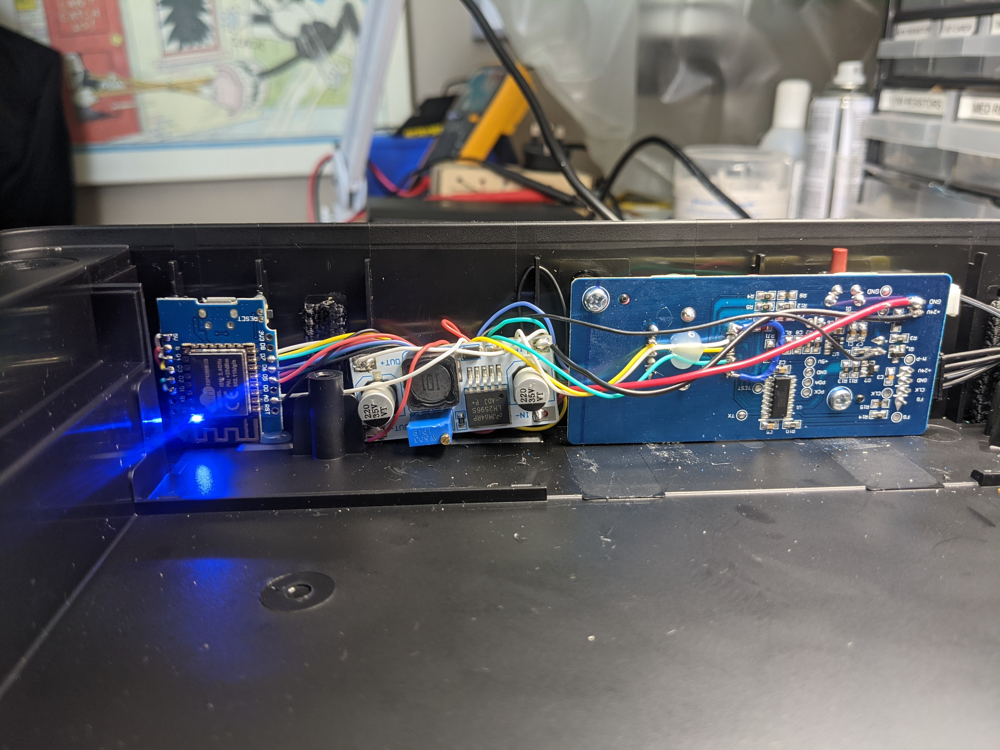

## ESPHome

I've included my yaml in this repo but it is a work in progress. The rotary dial still does odd things so that's next on the list to work out why. 

The plan was to get this running and once the internal sensors hit a reading, automatically turn the unit on using automations, like so:

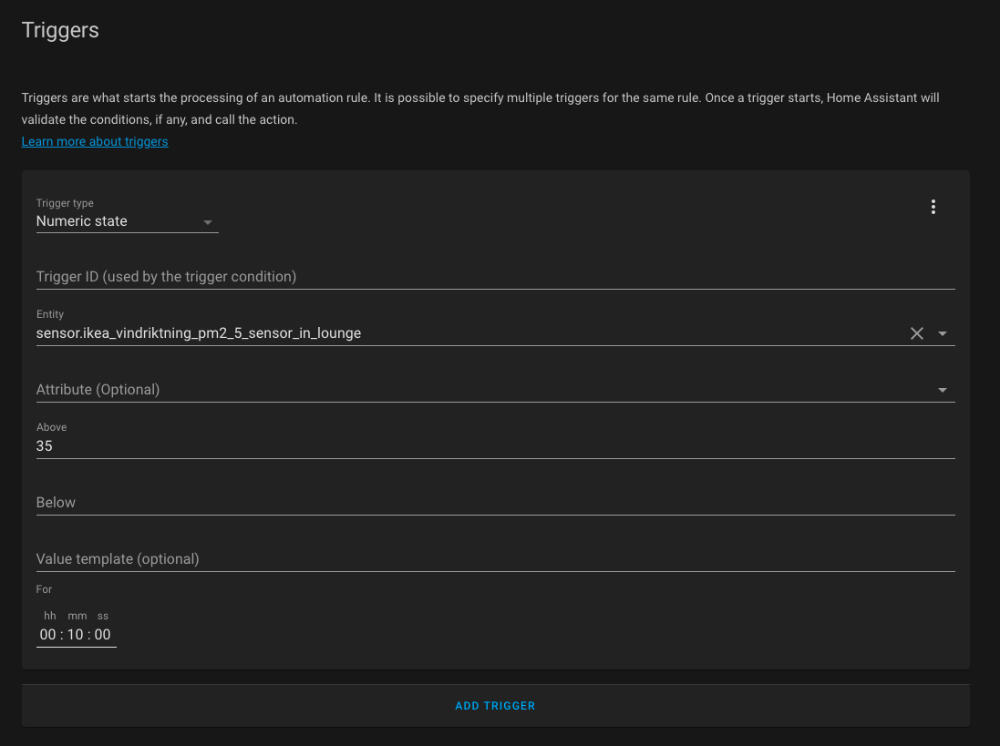
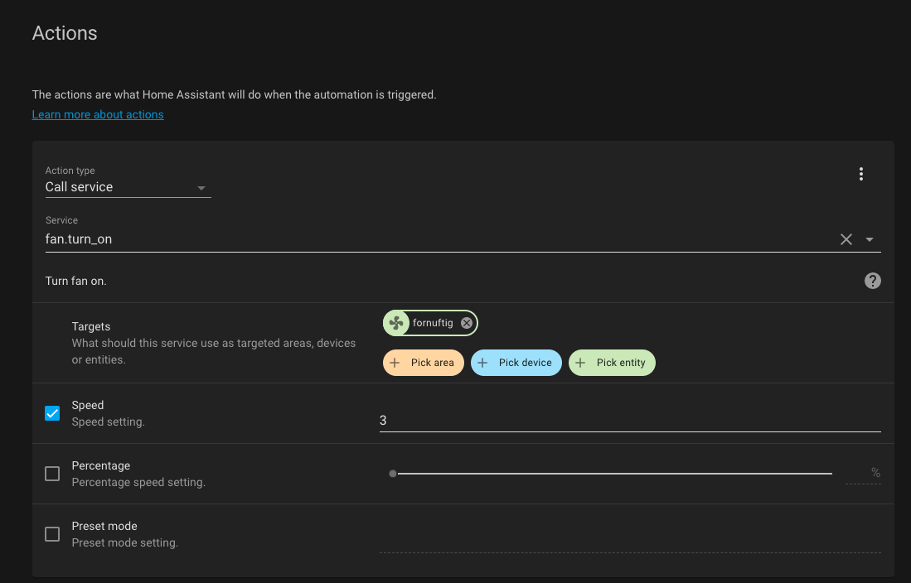

It sorta works

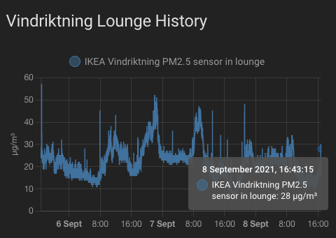
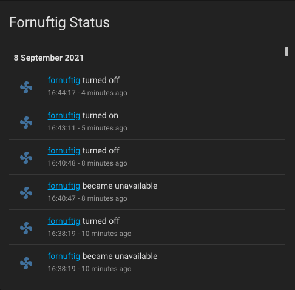

But the rotary dial isn't perfect and the status seems to show that it turns on and off a lot and i'm not sure why. I'll work this out. It does, however, clean the air when it is running so that's cool. 
