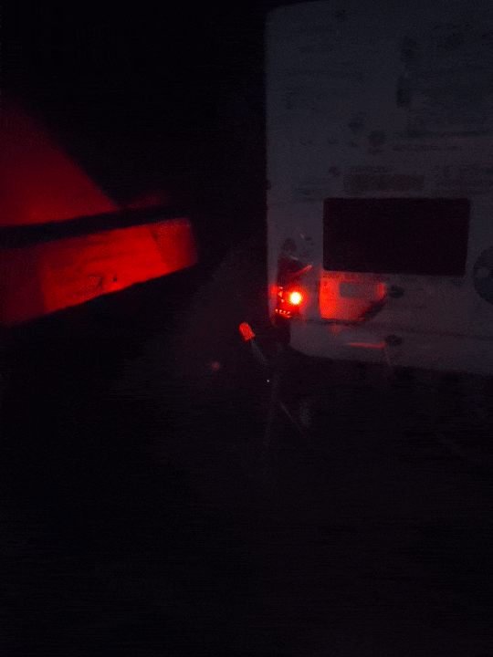
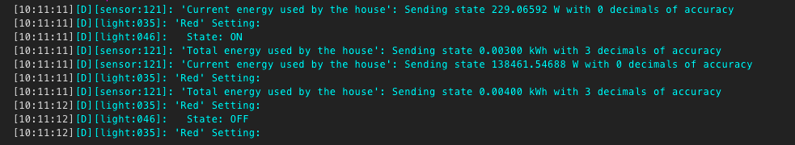
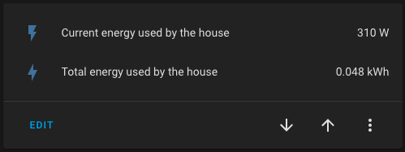

# The not so smart meter experience. 

Sadly the UK has a strange smart meter rollout. If you had one installed and then changed suppliers, your smart meter stopped being a smart meter and turned into a dumb one as each provider used their own network and displays. Whilst there are plans to migrate all to the new SMETS2 *smart meters*, this is very slow and means if you are unlucky enough to have a SMETS1 with no display, you are up shit creek. 

I wanted to take the data from our dumb meter and push it into Home Assistant and with recent changes to the code, it has never been easier thanks to the addition of *[pulse_meter](https://esphome.io/components/sensor/pulse_meter.html)*

## Hardware Needed

1. A photo diode sensor with 4 terminals
2. ESP32 device (I used a *Feather HUZZAH* based on the 8266 chipset)
3. 4 pin RGB LED
4. Cables (Dupont or straight)

## Connecting Tings

This is pretty straightforward and whilst the pins depend on the board you have picked, you should be able to follow along. 

| Component   | Source Pin | Component | Destination Pin |
| ----------- | ---------- | --------- | --------------- |
| Photo Diode | VCC        | Huzzah    | 3V3             |
| Photo Diode | GND        | Huzzah    | GND             |
| Photo Diode | D0         | Huzzah    | GPIO4           |
| RGB LED     | Red        | Huzzah    | GPIO14          |
| RGB LED     | Blue       | Huzzah    | GPIO13          |
| RGB LED     | Ground     | Huzzah    | Shared with GND |
| RGB LED     | Green      | Huzzah    | GPIO12          |

For GND, I soldered the RGB GND onto the opposite pin of the GND on the Huzzah. Once you've done this, I found it easier to plug this into the Home Assistant box via USB and flash it in the ESPHome page. 

The configuration you can adapt based upon the above table, is glow.yaml 

## Attaching Tings

The photo diode needs to be positioned so that the LED is over the pulse LED on the meter. I used clear stickytape to do this, I'm sure there are more elegant ways to achieve this but it works. 

If all goes to plan, the Huzzah LED should flash red every time it catches a pulse from the meter. If there are wifi issues, you will see a blue light. 

## Home Assistant Tings

Once you've added it in ESPHome and flashed it using glow.yaml, if you connect to the logs function, you should see this

If not, check that the LED is covering the pulse LED properly. 

If you see this, then you can add a panel to Lovelace that looks like this

Then the world is your oyster. 