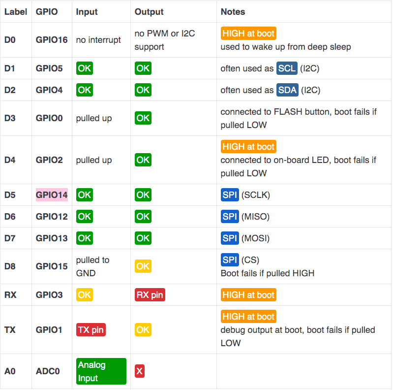
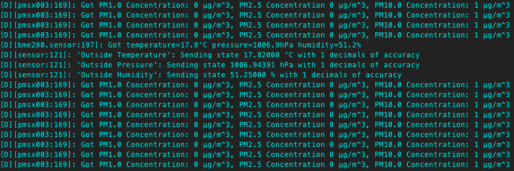
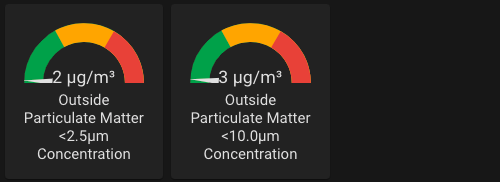
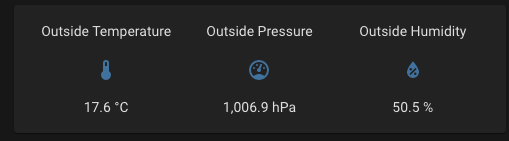
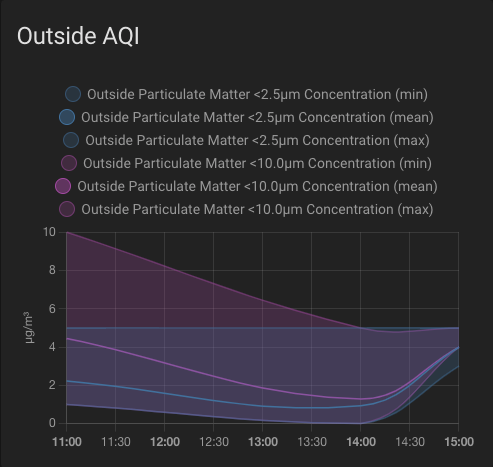

# Smutsig Air Quality Index Sensor

This is the evolution of my other [pollution](https://github.com/danielcuthbert/Pollution-Sensor) sensor, which used a Cortex M4 instead of an ESP8266. 

The idea was to make it fit within the Home Assistant setup with as minimal code as possible.


## Bill of Materials

In order this to work, you'll need the following:

1. ESP32 or ESP8266 board (I've chosen the ESP8266)
2. [PM2.5 Air Quality Sensor](https://www.adafruit.com/product/3686)
3. [BME 280 I2C/SPI Temperature Humidity Sensor](https://www.adafruit.com/product/2652)
4. Some kind of weather sensor box. The choice is yours
5. Long Micro USB cable - depending on where you install this, you might need a shorter one
6. Silicon wire 

Along with the above, you'll need a soldering station, some wires and solder and wire strippers. The following needs to be connected:

[BME280](https://cdn-learn.adafruit.com/downloads/pdf/adafruit-bme280-humidity-barometric-pressure-temperature-sensor-breakout.pdf)

| BME280 Pin | ESP8266 Pin |
| ---------- | ----------- |
| VCC        | 3.3V        |
| GND        | GND         |
| SCL        | GPIO5       |
| SDA        | GPIO4       |

[PME25](https://cdn-learn.adafruit.com/downloads/pdf/pm25-air-quality-sensor.pdf)

| PMS5003 Pin | ESP8266 Pin |
| ----------- | ----------- |
| TX          | GPIO14      |
| VCC         | 5V          |
| GND         | GND         |

It's important to point out a few things here with regards to UART. If you are using ESPHome, by default, it will use the hardware UART unit on the board (GPIO1, which is labeled TX, and GPIO3, which is labeled RX). I have found that if you don't specify another pin, this causes issues with logging. Luckily, the [ESP8266](https://tttapa.github.io/ESP8266/Chap04%20-%20Microcontroller.html) has two UARTS, so you can specify another pin to use that doesn't cause boot issues. 

There are issues with certain pins, so this should help you choose the right ones



If all goes to plan with the soldering, the next step is creating the firmware via ESPHome. I've left my full yaml in this repo for you to abuse and use as you see fit. To help, here's some of the options I've set:

**PM2.5 Readings** 

```
      pm_2_5:
        name: "Outside Particulate Matter <2.5µm Concentration"
        filters:
        - sliding_window_moving_average:
            window_size: 180
            send_every: 180
```
If you chose the PMS5003 sensor, you can read 1.0, 2.5 and 10.0 particulate matter readings, however I'm only interested in 2.5 and 10. If you want 1.0, uncomment it out. 

The readings themselves. ESPHome comes with a very handy filter set, one of them is the sliding window moving average whereby you can grab a number of values (window_size) in order to push out a final value (reading). In the above example, I'm grabbing 180 values (seconds) and sending them every 180 seconds. YMMV in this regard, so please don't take my approach as gospel and experiment with your own data. 

## Sniff Sniff Sniff

If all the wiring was correct and you were able to build the firmware and push it to the device ok, you *should* see the following in the logs:




Next up is adding it to your Home Assistant and playing with how you want the data displayed. Here's some ideas




