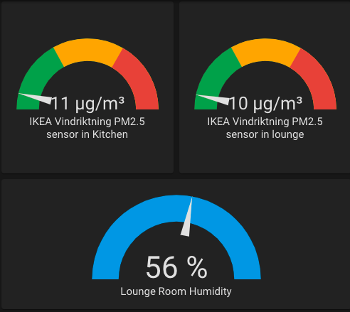

# VINDRIKTNING

With the outside pollution sensor up and running, my mind got thinking about how pollution from outside travels inside once we open windows. I spent a while looking at potential solutions I could use and abuse and then IKEA released the [VINDRIKTNING](https://www.ikea.com/gb/en/p/vindriktning-air-quality-sensor-80515910/), a very cheap particulate matter (PM 2.5) sensor powered by USB-C and costing less than a tenner. 

You had me at cheap, so hello meatballs 'n gravy and a trip to IKEA to grab a few. 

## Hardware Breakdown

At 86x52x52mm, this is small unit that's well-designed and functional (as most IKEA products are)


It works by pulling in air, via a fan, into the PM2.5 sensor ([PM1006 v1.1](https://pdf.directindustry.com/pdf/cubic-sensor-instrument-co-ltd/pm1006k-led-particle-sensor-module/54752-927719.html)) that is controlled by a small PCB with an LED for indicating the results 


The heart of the beast is an Eastsoft ES7P001FGSA MCU. So far can only find the [datasheet](http://datasheet.eeworld.com.cn/new_part/ES7P001FGSA,eastsoft,22824685.html) in Chinese, but it has the pinouts so that's all I needed to fiddle with.


Soldered on a wire for easier access to GND and plugged in the PCBites


## How Does It Work?

Depending on the readings, the unit will display three colours: Green, Amber and Red

Using my Saleae, I set about seeing this happen

Healthy reading (green)


Amber reading (amber)


Get out of there reading (red)


Ok that's cool but how? how does this sensor work? Well it's pretty simple once you read the datasheet. The PM1006K receives 11 02 0B 01 E1 from the MCU and sends out the results. If this interests you, I'd recommend this [paper](https://journals.plos.org/plosone/article?id=10.1371/journal.pone.0185700) on how PM sensors work


I wanted to see the MCU request the values from the PM and the returned values. First up with Sally the oscilloscope


then the Saleae


You can see 5 bytes being sent by the MCU, 11 2 0b 01 E1, which takes 5.01 ms to get the response back. It then takes that value and displays the colour. 

## ESP8266 Wiring

Knowing how it works, the next step was adding capability to get the data into a more usable tool like Home Assistant. I originally had a Adafruit Feather spare but it couldn't handle the 5V that the unit pushed out and I didn't want to mess around with a buck converter, so ended up using a Wemos D1 mini (which I'm in love with). 

It's super small and slots right in. 


The wiring is as follows:

| VINDRIKTNING PCB     | Wemos D1 |
| ----------- | ----------- |
| +5V      | 5V      |
| GND   | GND        |
| REST   | D2        |

I also added a humidity and temperature sensor to one of the units. There's enough space for a [DHT11](https://learn.adafruit.com/dht)

Once you've soldered it all up, it should look like this 


## ESPHome & Home Assistant

Adding it to Home Assistant using the amazing [ESPHome](https://esphome.io/) option couldn't be easier

```
  uart:
  rx_pin: D2
  baud_rate: 9600

sensor:
  - platform: pm1006
    pm_2_5:
      name: "IKEA Vindriktning PM2.5 sensor in lounge"
      
      
  - platform: dht
    model: DHT11
    pin: D3
    temperature:
      name: "Lounge Temperature"
    humidity:
      name: "Lounge Room Humidity"
    update_interval: 60s
```    

Once you've flashed the device and added it to HA, you should be able to create graphs like so



  