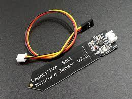
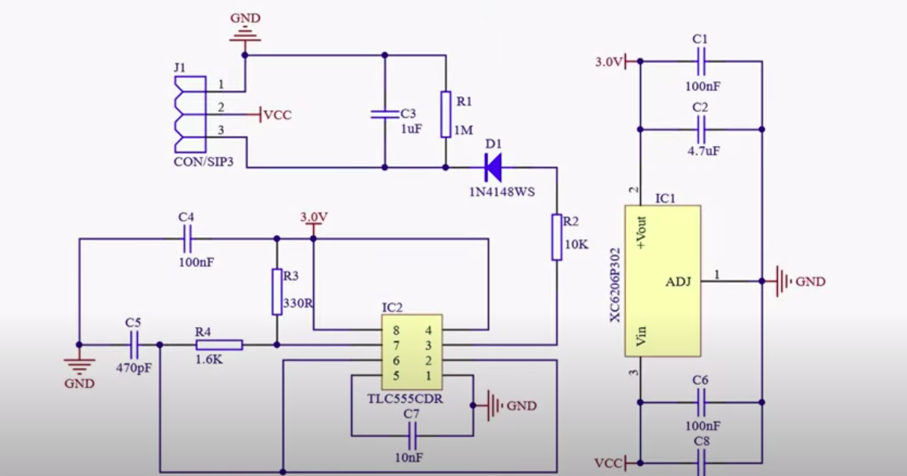
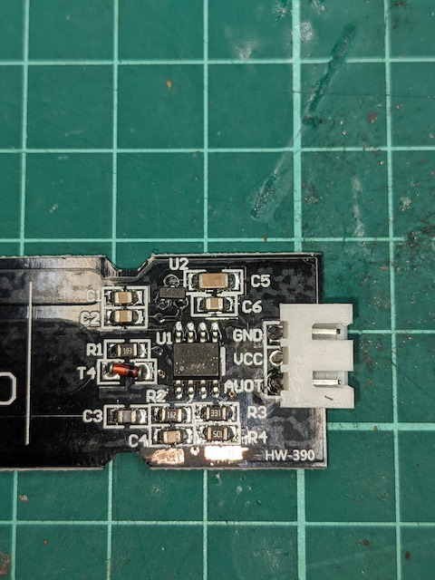
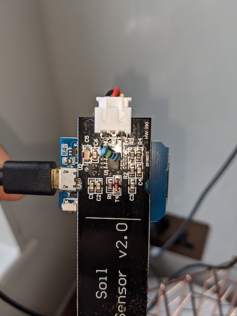
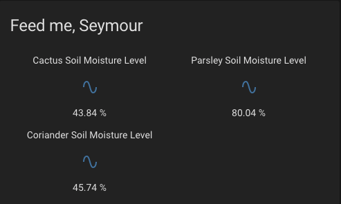
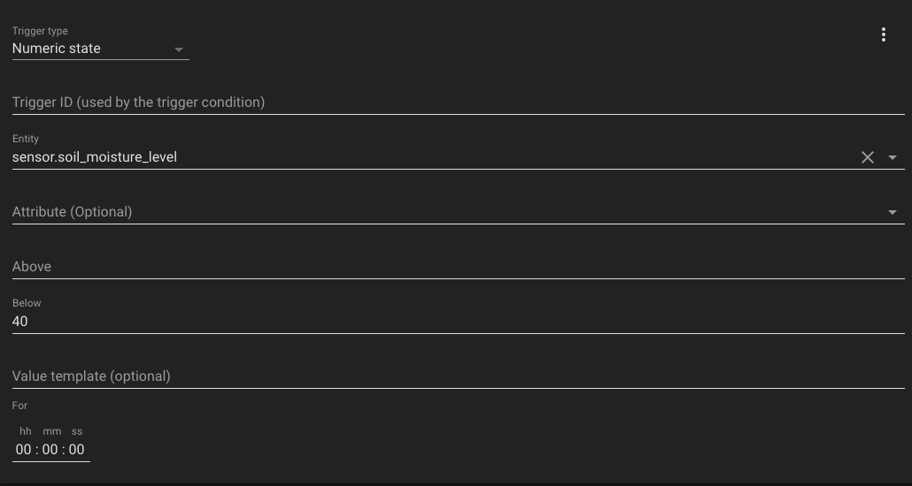
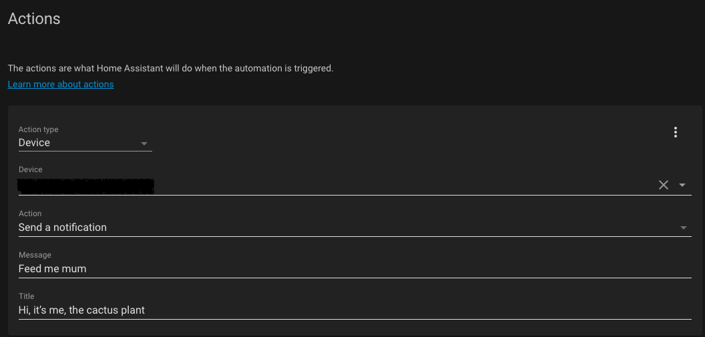

# Växter


She who must be listened to, or the CFO, likes her plants and herbs and having many means the watering process can be a bit hard. I set about trying to earn some much-needed husband points by building some automated measuring process that could fit into our Home Assistant (HA) setup and also send her a push notification to tell her when they need love. 

What I needed was a capacative soil moisture sensor and something to take those readings and push them into HA and thankfully both the former and the latter are easily available. 



## Bill of Materials

1: Capacative soil moisture sensor. I opted for the [V2.0](https://smile.amazon.co.uk/dp/B094NG3MCD/ref=cm_sw_r_tw_dp_GR75GGX6XRMDYVSX35FR) one
2: Wemos D1 Mini (with the ESP8266 chipset)
3: Some wiring, wire cutters and strippers

**Shoddy Products**

I think it prudent to start this off with a warning. Not all capacative soil moisture sensors are the same. It has become clear that YMMV when buying them and some might not work out of the box. It seems there are three key issues that could be present:

1: The use of a cheaper 555 chip (timing chip) cannot handle lower voltages, such as those used by batteries when they discharge. This will destroy the readings.
2: Some are missing the voltage regulator
3: Some have a glaring mistake in the PCB design whereby a resistor is missing a connection and that too messes up the sensor readings as it isn't connected to GND.
4: The 8266 ADC has a range of 0-1V, so take this into account



A faulty sensor will look like this



These were the ones I got and scraping away the silkscreen, you can see the resistor has no path to GND. Utter screw up basically but worry not, if you do get one like this, you can easily fix it with a 1M Ohm resistor, like so



## Wiring It All Up

Using the Wemos D1, I snipped the supplied wiring for the sensor (VCC, GND, AOUT) and made them shorter. You want to solder those wires like so:


|  Capacative Sensor	    | Wemos D1      |
| ---- | ---- |
| VCC  |   3.3V   |
| GND     |    GND  |
| AOUT     |   A0   |

Once soldered, I used hot glue to fix the back of the Wemos to the sensor.


## ESPHome 

Once you've plugged it in, you need to create it within ESPHome. This is pretty simple and I've included my current YAML config. 

### Calibration

The sensor needs to be calibrated to your environment. What this means is you need to take measurements of it in the air and submerged in soil that is wet. This should give you some baselining to use going forward. 

During my experiments, I got the following values:

Dry (in air) is 0.71V
In a wet env it is 0.47V
Fully submerged it is 0.3V

Using those values that you discovered, you can edit my YAML accordingly:

```
# Dry (in air) is 0.71V
# In a wet env, it is 0.47V
# fully submerged, it is 0.3V


  - platform: adc
    pin: A0
    id: moisture1
    name: "Cactus Soil Moisture Level"
    unit_of_measurement: "%"
    accuracy_decimals: 2
    state_class: measurement
    icon: "mdi:water-percent"
    update_interval: 60s
    filters:
      - calibrate_linear:
          # Map the voltage reading when fully submerged in water to 100% moisture
          - 0.27441 -> 100.0
          # Map the voltage reading when completely dry to 0% moisture
          - 0.67578 -> 0.0
```

If all goes well, you should start seeing results in the log files. 

### Automation & Push Notifications

My current dashboard looks like so:



Automating this is pretty easy. Go to Configuration --> Automations


Click on new and use the following (which worked for me)




Once the reading get to the level specified, the device will get a push notification. Simples. 

