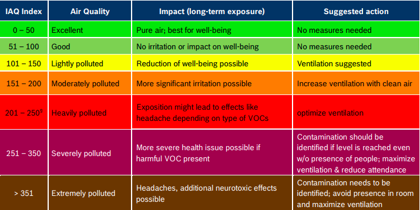

# Volatile organic compounds (VOCs)

Volatile organic compounds (VOCs) are emitted as gases from certain solids or liquids. We are often surrounded by these VOCs and rarely realise it. They include a variety of chemicals, some of which may have short- and long-term adverse health effects. Concentrations of many VOCs are consistently higher indoors (up to ten times higher) than outdoors. VOCs are emitted by a wide array of products numbering in the thousands.

With that in mind, I set about building a sensor that could detect such VOCs, where possible and this is that journey.

## Impact of VOCs

VOCs are found in a number of sousehold products, including:

* paints, paint strippers and other solvents
* wood preservatives
* aerosol sprays
* cleansers and disinfectants
* moth repellents and air fresheners
* stored fuels and automotive products
* hobby supplies
* dry-cleaned clothing
* pesticide

and other products, such as:


* building materials and furnishings
* office equipment such as copiers and printers, correction fluids and carbonless copy paper
* graphics and craft materials including glues and adhesives, permanent markers and photographic solutions.

## Choice of Sensors


I spent time looking at all sensors capable of detecting such gasses and Bosch came up as the most cost effective and capable option for home use with two models: [BME680](https://www.bosch-sensortec.com/products/environmental-sensors/gas-sensors/bme680/) and [BME688](https://www.bosch-sensortec.com/products/environmental-sensors/gas-sensors/bme688/)

Both are very capable but I've chosen the BME 688 due to the Artificial Intelligence function, which will allow me to train the sensor with Machine Learning based on the above VOCs we use within the house. This is performed using Bosch's BME AI-Studio Software. Sadly due to global supply shortages, my development board has not yet arrived so for now I shall be using the default datasets. 

## Indoor Air Quality Measurements

The sensor is capable of returning a number of values depending on the air quality where it is based. They are: 

1. Index for Air Quality (IAQ) - An index that can have values between 0 and 500 with a resolution of 1 to indicate the quality of the air available. 
1. Biogenic volatile organic compound (bVOC) All plants emit a wide range of volatile compounds such as nitric oxide, carbon monoxide, and non-methane volatile organic compounds, the so-called biogenic volatile organic compounds (BVOC)
1. Carbon Dioxide (CO2) - measured in parts per million (ppm)
1. Gas Results 

IAQ classification looks like so:



## Home Assistant/ESPHome Configuration

As with all my sensors, I've made use of the Wemos D1 Mini as it works so well. The yaml file reflects this and if you are using something else, edit accordingly. 

The sensor needs burn-in time for it to function correctly. I gave it 12 hours but some reckon 20 minutes is fine. Currently ESPHome doesn't have a dedicated BME688 plugin but the [BME680](https://esphome.io/components/sensor/bme680.html) will work just as well. 

You can configure your BME680/BME688 in a number of ways, depending where it is installed. For example, if this is a wearable device, you can specify that in your yaml file using the following line:

```
# IAQ calculation mode
    # --------------------
    # Available options:
    # - static (for fixed position devices)
    # - mobile (for on person or other moveable devices)
    # Default: static
    iaq_mode: mobile
```    

You also have the option to change how the sensors are sampled: 

```
# Sample rate
    # -----------
    # This controls the sampling rate for gas-dependant sensors and will govern the interval
    # at which the sensor heater is operated.
    # By default this rate will also be used for temperature, pressure and humidity sensors
    # but these can be overridden on a per-sensor level if required.
    #
    # Available options:
    # - lp (low power - samples every 3 seconds)
    # - ulp (ultra low power - samples every 5 minutes)
    # Default: lp
    sample_rate: ulp
```

###IAQ Accuracy and Calibration

The BSEC algorithm automatically gathers data in order to calibrate the IAQ measurements. The IAQ Accuracy sensor will give one of the following values:

* Stabilizing: The device has just started, and the sensor is stabilizing (this typically lasts 5 minutes)
* Uncertain: The background history of BSEC is uncertain. This typically means the gas sensor data was too stable for BSEC to clearly define its reference.
* Calibrating: BSEC found new calibration data and is currently calibrating.
* Calibrated: BSEC calibrated successfully.
* 
Every state_save_interval, or as soon thereafter as full calibration is reached, the current algorithm state is saved to flash so that the process does not have to start from zero on device restart.
