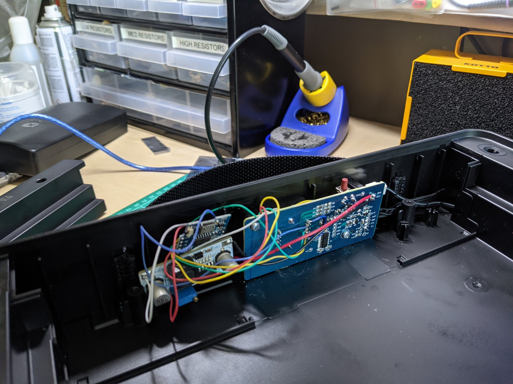

# Connect All Teh Tings

What started out as me wondering what the pollution levels were outside my house, thanks to the use of ugly fuels like diesel and London's inability to create clean air, turned into a journey of learning about ESP32's, ESP8266's, Home Assistant and collection of pollution data collection sensors. 

This repo is a place to house all of the things I'm messing with. 

## External Pollution Sensor (Cortex M4)

First up is the [external](https://github.com/danielcuthbert/Pollution-Sensor) pollution sensor

This was built to grab readings from outside our front door and makes use of Adafruit's brilliant Feather M4 express, a PM 2.5 sensor and BME 280 for temperature and humidty. I then push the data into io.adafruit.com. 

Plans are in action to bring this back into the Home Assistant setup, which will probably see me removing the use of the Feather and adopting a Wemos D1, which I've fallen in love with. 

## External Pollution Sensor (ESP8266)

Similar to the above, this one uses a Wemos D1 instead of the Cortex M4 and pushes the data into my Home Assistant set up instead of Adafruits. 

This project can be found here

## Internal Pollution Sensors

IKEA released the most amazing little pollution sensor in the form of the [VINDRIKTNING](https://www.ikea.com/gb/en/p/vindriktning-air-quality-sensor-80515910/) and many of us thought 'this could be hacked with' and I did just that one Sunday afternoon. 

You can read about these over [here](https://github.com/danielcuthbert/home-assistant/tree/main/Vindrikting)

## Internal Air Purifier

I was then bored and had an idea: what if I read the internal pollution levels and if they went above a threshold, I turned on an air purifier? Thankfully IKEA came to the rescue with their cheap [FÖRNUFTIG](https://www.ikea.com/gb/en/p/foernuftig-air-purifier-black-40488065/) offering and I set about hacking this too. 

That project lives in [here](https://github.com/danielcuthbert/home-assistant/tree/main/Fornuftig)
