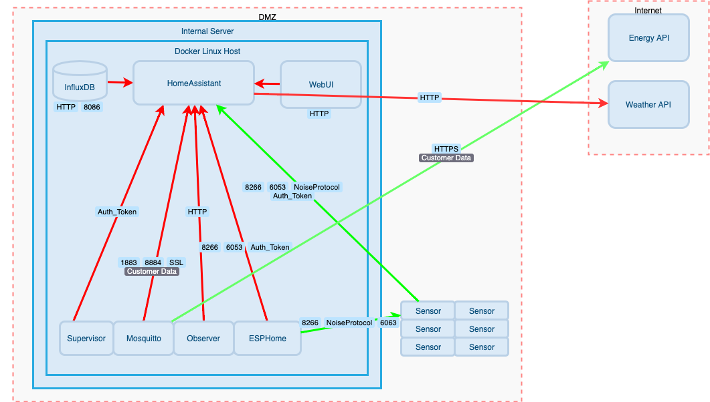

# Connect All Teh Tings

What started out as me wondering what the pollution levels were outside my house, thanks to the use of ugly fuels like diesel and London's inability to create clean air, turned into a journey of learning about ESP32's, ESP8266's, Home Assistant and collection of pollution data collection sensors. 

This repo is a place to house all of the things I'm messing with. 

## External Pollution Sensor (Cortex M4)

First up is the [external](https://github.com/danielcuthbert/Pollution-Sensor) pollution sensor

This was built to grab readings from outside our front door and makes use of Adafruit's brilliant Feather M4 express, a PM 2.5 sensor and BME 280 for temperature and humidty. I then push the data into io.adafruit.com. 

Plans are in action to bring this back into the Home Assistant setup, which will probably see me removing the use of the Feather and adopting a Wemos D1, which I've fallen in love with. 

## External Pollution Sensor (ESP8266)

Similar to the above, this one uses a Wemos D1 instead of the Cortex M4 and pushes the data into my Home Assistant set up instead of Adafruits. 

This project can be found here

## Internal Pollution Sensors

IKEA released the most amazing little pollution sensor in the form of the [VINDRIKTNING](https://www.ikea.com/gb/en/p/vindriktning-air-quality-sensor-80515910/) and many of us thought 'this could be hacked with' and I did just that one Sunday afternoon. 

You can read about these over [here](https://github.com/danielcuthbert/home-assistant/tree/main/VINDRIKTNING)

## Internal Air Purifier

I was then bored and had an idea: what if I read the internal pollution levels and if they went above a threshold, I turned on an air purifier? Thankfully IKEA came to the rescue with their cheap [FÖRNUFTIG](https://www.ikea.com/gb/en/p/foernuftig-air-purifier-black-40488065/) offering and I set about hacking this too. 

That project lives in [here](https://github.com/danielcuthbert/home-assistant/tree/main/Fornuftig)

## Soil Moisture Sensors

She wanted to know when her plants needed a water. Her wish was my command. You can find out more about that over [here](https://github.com/danielcuthbert/home-assistant/tree/main/Vaxter)

## Fans

I wanted to create an automation function that monitored Los Diablos's room temperature and turned on the fan when it hit a certain level. We've done such an amazing job insulating their room that it gets hot, very hot and as such, they turn on the fan often but forget to turn it off. This is that [journey](https://github.com/danielcuthbert/home-assistant/tree/main/Blaser)

## Security & Threat Models

You cannot have IoT without security, so here's a [page](https://github.com/danielcuthbert/home-assistant/blob/main/threat_model.md) that walks you through the threat model I created. I shall continue to update it with threats and countermeasures I come up with to make this all tight and secure. 

## Noise Protocol Framework

With the 2021.9.0 release, we saw a very cool feature added by https://github.com/OttoWinter namely support for the noise protocol. This now means you can add a layer of encryption to the API for all nodes, which is sexy!

The [Noise Protocol](http://www.noiseprotocol.org/) is a framework that allows anyone to build crypto protocols without the added complexity that often comes with implementing crypto. Setting this up is pretty easy. 

### YAML Config

For each node, you need to add the following:

`api:``
  ``encryption:``
  ``key: !secret outside_api_encryption_key`

This enables noise. You also need to add the corresponding entry into the new secrets.yaml pane in your ESPHome page. The key itself is a pre-shared 32-byte base64 encoded string, which you can generate using the following command:

`openssl rand -base64 32`

Once you've rebuilt your firmware and pushed it to the device, you'll need to add this key to Home Assistant in order to re-auth. 