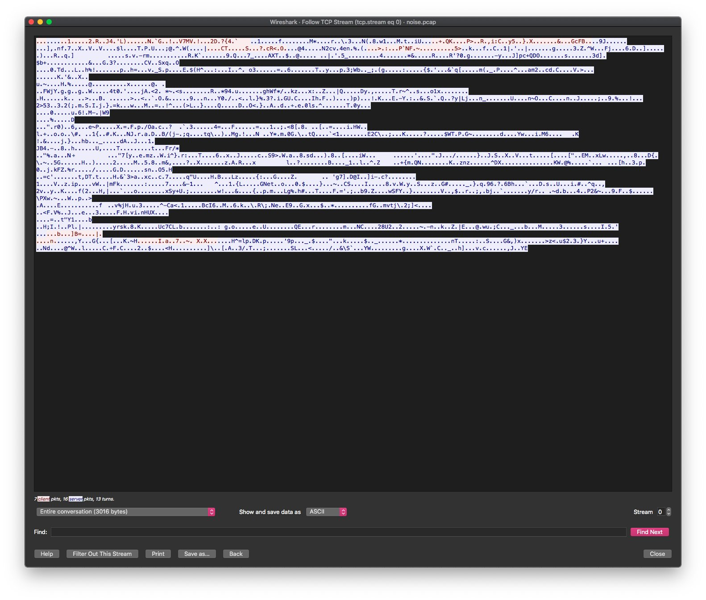

# The Joys of Threat Models

Threat models are cool. They help you perform systematic analysis of controls and defences needed when you are designing, developing and deploying $THING. 

This is really important as trying to retrofit this once $THING has been built is actually much harder. A good threat model helps you understand the paths an attacker may/may not take when trying to pwn $THING. 

Often, as is the case with Internet of Things, many assume that there's zero chance of making it secure and give up, but that isn't always the case and I felt maybe performing a threat model against this architecture might show others the benefits of doing one. 

Like I said at the start, threat models are cool. 

## Key Components

There are a handful of components that make up a good threat model. Some you have full control over, others not so much. At a minimum, you should have the following in your threat model:

1. Asset Identification - You cannot protect what you don't know. 
2. Risk Level - What's at risk here?
3. Threats & Countermeasures - How will it get pwned and what can I do to prevent that from happening?

### Asset Identification

My threat model makes use of the brilliant [IriusRisk](https://www.iriusrisk.com/) threat modeling platform. It is commercial but they have a community offering too and it's really good and easy to use and that's important as this shouldn't be seen as a struggle. 

The first most vital thing you need to do is working out what the hell you have. So many fail at this, it's one of the biggest weaknesses in our industry in that so many don't know how X works, what ports it communicates on, whom it communicates with etc. This has to change as you cannot protect what you don't know about. 

So with that in mind, I set about creating a network architecture diagram of this Home Assistant setup along with data flows

What you see here is are two Trust Zones, areas of trust separated by Trust Boundaries, and inside of them are components. In this case, I have my internal DMZ and the Intertubes. Now some could argue that if you are to apply the Zero Trust principle (and indeed you should), then we remove the notion of Trust Zones and I'd agree with you but for this example, I'm going to adopt a more traditional model of trusted internal network and dirty ugly Internet. Don't @ me

I have a Linux server that hosts all my Docker containers and databases. Creating each one and mapping the data flow (how data moves from component to component), including the ports used and other information that helps anyone understand the overall architecture. 

In addition, where applicable, I include where customer data, PII etc is stored, processed and transmitted. 

This is a lengthy process but I can attest that doing this sets the foundation for all to come and it's generally good practice to do. 

**Standards**

I do like standards, mostly because they help us in many ways. For example, I'm the co-author of the [OWASP Application Security Verification Standard (ASVS)](https://owasp.org/www-project-application-security-verification-standard/), a mouthful I know, and this helps people design and build secure web applications. Seeing as I have a main web application, I should apply the ASVS Level 2 standard to this. 

I can choose many other standards, depending on what it is $THING does and it helps you ensure it is not only compliant but also secure. 

## Threats & Countermeasures

As I said at the start of this guide, a threat model should tell you what the threats are to $THING and what you can do to mitigate these threats. It's a risk summary of sorts and whilst I find most things risk rather boring, they do have a place. If all went well, you should end up with some risk score that looks like so

A medium risk score on first glance, but what I'm interested in are the actual threats to the overall architecture and individual components

Now a caveat: understanding current threats against many systems, devices, networks and so on is one hell of a task. There is no way in hell most can do this and keep updated and this is where traditional threat modeling tools start to fail miserably. You are probably not an attacker, you might never have pwned the shit out of something to steal data or move laterally around a network, so how do you know what the threats are? 

This is where a good partner comes into play and why I like IriusRisk. They do the work for you so you don't have to and this is really important. 

Here are my components that make up the entire architecture and I can drill down to see the threats each component has against them. 

Now, depending on how big your architecture is, this could take some time and I recommend you export the data to a more usable tool, like JIRA or the likes. This way you can assign the individual threat to you, or someone else, and track the lifecycle of that threat. 

The other key part of any threat model is understanding the threat and how it might relate to that component

For example, I make use of two external APIs that sit on the Internet. One of them uses an auth token and TSL and the other doesn't. I can't really harden them as they are not my systems, so I can add the risk as accepted, like so:

For each threat, you need a countermeasure - how the hell are you going to frustrate any attacker? 

This is where the main work happens. In order for you to have a secure system, you need plenty of countermeasures. 

With the case of IoT, there are many things that can be exploited and indeed have. Two of them relate to the communications between nodes. Often this is via a plain-text protocol (HTTP/API) and this is where it all falls apart. 

Consider this: a default node that exposes an API and can be consumed by a Web UI

As you can see, all the traffic is in plain-text and if the attacker was on the same network as the nodes, they could sniff this traffic and potentially capture sensitive information. The same goes for Over The Air (OTA) updates, a process whereby a UI updates the node with new firmware

We have this as a threat and we need to act upon that. The obvious approach is to add a new countermeasure and one that makes use of encryption.

Once we've done that, wrote the code that ensures the firmware makes use of the amazing [Noise Framework Protocol](https://noiseprotocol.org/), and we go about testing the countermeasure works

We now have encypted communications between nodes and the UI, so that threat is now no longer valid and the model needs to be updated. Throughout the threat model, you will see countermeasures you need to apply and this is the power of a good threat model, it spells it out for you

## Final Thoughts

I'm hoping this helps you see the value of a good threat model and how one could go about creating something usable. I'll do my best to continue to keep this updated, so others can learn from the process. 